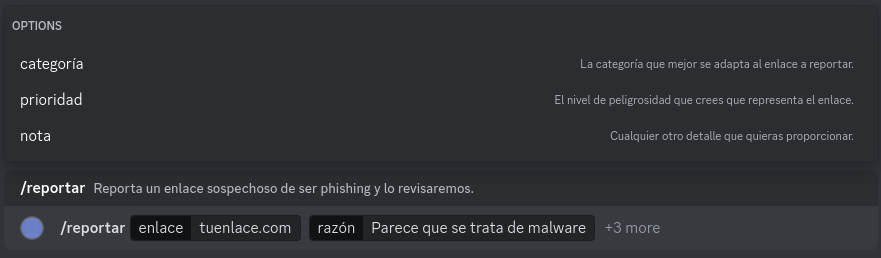

# 📌 Añadir dominios

**Añadir dominios** a la API es **muy sencillo** y hay dos formas posibles de hacerlo. Antes de nada, ten en cuenta que los enlaces son revisados por un equipo que se asegura de que no se manden solicitudes con falsos positivos, por lo que recomendamos no abusar del sistema. Ahora sí, vamos a ver cómo añadir esos dominios.

### :desktop: Mediante la API

La manera más rápida de hacerlo si quieres un proceso lo más simple posible es usando los propios métodos de la API. Se trata de una simple petición POST al endpoint de los dominios. Puedes ver cómo hacerlo en la [parte correspondiente de la documentación](../reference/api-reference/domains.md#anadir-un-dominio).

### :robot: Mediante el bot

Otra manera de hacerlo, mucho más cómoda si estás en Discord, es mediante nuestro bot oficial. Es tan fácil como usar el slash command que ves a continuación:

<figure> <razón> [categoría] [severidad] [nota]"><figcaption></figcaption></figure>

Como ves, se trata del comando `/reportar`, y el propio comando te indica qué debes proporcionar, siendo "enlace" y "razón" los únicos valores obligatorios.


¡Listo! Si todo ha ido bien, el equipo de revisores habrá recibido la petición de añadir el dominio y estará trabajando porque este disponible en la API lo antes posible.

